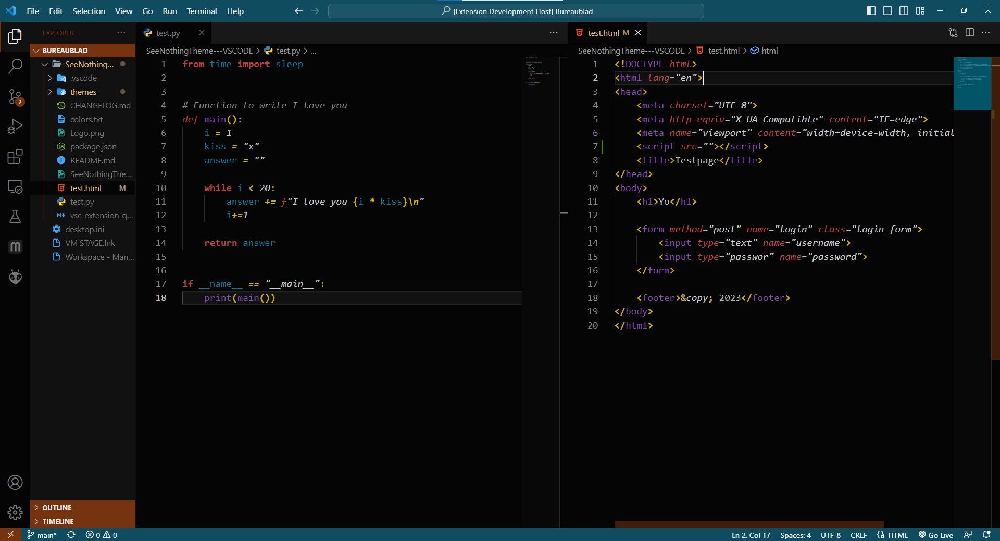

# SeeNothing

**Clean professional coding theme. Styled to be as dark as possible, but still clean with lether themed matte colors!**

Checkout [my Github](https://github.com/SpastBanana) for more work! 

## Enjoy!

| Info | Date | Update | Description |
| --- | --- | --- | --- |
| First push | 22-02-2023 | 0.0.1  | Created project structure |
|  | 23-02-2023 | 0.1.1  | Bugfix for 'keyword' and 'storage' types |
|  | 23-02-2023 | 0.1.2  | Changed bracket and operator colors for more contrast |
| Last version of V0.1 series | 23-02-2023 | 0.1.3  | Changed some accent colors to not display all words one color in python, and made the variable standard blue lighter |
| --- latest --- | 24-02-2023 | 0.2.1  | Fixed color bugs in markup languages and created a whole new color palette |